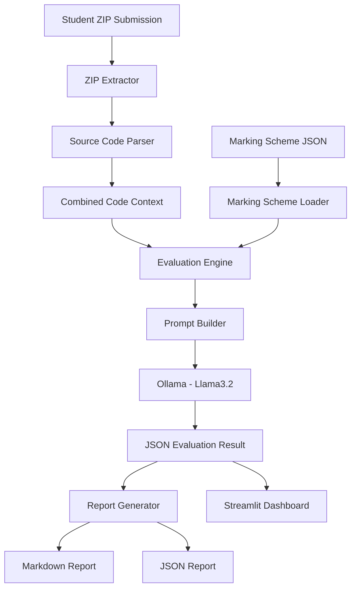
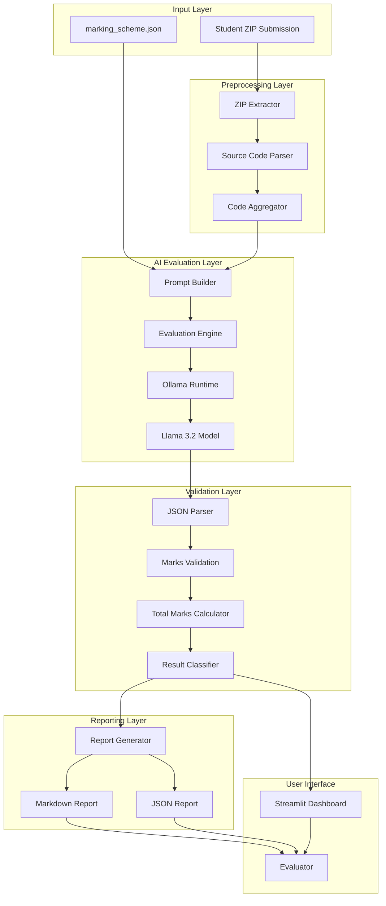

# Sunbeam Lab Evaluation Assistant\n\nProject skeleton generated by ChatGPT.\n

1. Mermaid Architecture Diagram
# Sunbeam Lab Exam Evaluation Assistant

## Architecture Diagram

2. Implementation Plan (5 Points)
## Implementation Plan

1. Accept student ZIP submissions and extract all source files.
2. Load the evaluation marking scheme from a configurable JSON file.
3. Convert all source files into a unified code context for evaluation.
4. Use a locally hosted LLM (Llama 3.2 via Ollama) to perform evidence-based assessment.
5. Generate structured reports containing marks, comments, evidence, and final results.

3. Execution Flow (10 Points)
## Execution Flow

1. Evaluator uploads a student's ZIP submission.
2. Application extracts the ZIP archive.
3. Source code files are identified and loaded.
4. All source files are merged into a single evaluation context.
5. Marking scheme is loaded from marking_scheme.json.
6. Prompt is dynamically generated using the marking scheme and source code.
7. Llama 3.2 model is invoked through Ollama.
8. The model evaluates each criterion and awards marks.
9. Application validates and recalculates total marks.
10. Markdown and JSON evaluation reports are generated and displayed to the evaluator.

4. Evaluator Assistant App Implementation
## Evaluator Assistant App Implementation

### Technologies Used

- Python 3.x
- Streamlit
- Ollama
- Llama 3.2
- LangChain-Ollama
- JSON
- ZIP Processing

### Core Modules

#### 1. Parser Module
Responsible for:
- ZIP extraction
- File discovery
- Source code loading

#### 2. Marking Scheme Loader
Responsible for:
- Reading marking_scheme.json
- Loading evaluation criteria
- Supporting configurable exams

#### 3. Prompt Engineering Module
Responsible for:
- Creating evaluation prompts
- Defining scoring instructions
- Enforcing JSON output format

#### 4. AI Evaluation Engine
Responsible for:
- Interacting with Llama 3.2
- Section-wise assessment
- Partial marking
- Evidence extraction
- Feedback generation

#### 5. Validation Layer
Responsible for:
- Recalculating total marks
- Preventing invalid scores
- Classifying results:
  - FAIL
  - BELOW AVERAGE
  - GOOD
  - VERY GOOD

#### 6. Report Generator
Responsible for:
- Markdown report generation
- JSON report generation
- Evaluation summary creation

#### 7. Streamlit User Interface
Responsible for:
- ZIP upload
- Evaluation execution
- Report display
- Download support

5. Additional Section (Recommended)
## Key Features

- Evidence-Based Evaluation
- Partial Marking Support
- Multiple Valid Solution Acceptance
- Configurable Marking Scheme
- Local LLM Execution
- Structured JSON Output
- Markdown Report Generation
- Human Evaluator Assistance
- Offline Processing
- Consistent Scoring

## Architecture Diagram

+--------------------+
| Student ZIP        |
+--------------------+
          |
          v
+--------------------+
| ZIP Extractor      |
+--------------------+
          |
          v
+--------------------+
| Source Code Parser |
+--------------------+
          |
          v
+--------------------+
| Code Aggregator    |
+--------------------+
          |
          +--------------------+
                               |
+--------------------+         |
| Marking Scheme     |---------+
+--------------------+
          |
          v
+--------------------+
| Prompt Builder     |
+--------------------+
          |
          v
+--------------------+
| Evaluation Engine  |
+--------------------+
          |
          v
+--------------------+
| Ollama + Llama3.2  |
+--------------------+
          |
          v
+--------------------+
| JSON Evaluation    |
+--------------------+
          |
          v
+--------------------+
| Validation Layer   |
+--------------------+
          |
          v
+--------------------+
| Report Generator   |
+--------------------+
      /        \
     v          v
 Markdown     JSON
  Report     Report
      \        /
       v      v
    Streamlit UI
          |
          v
      Evaluator

      Good morning sir.

My project is **Sunbeam Lab Exam Evaluation Assistant**.

The objective of this project is to help lab exam evaluators assess student submissions more efficiently and consistently using Generative AI. The application acts as an assistant and does not replace the human evaluator. The final decision always remains with the evaluator.

The technology stack used in this project includes Python, Streamlit, Ollama, Llama 3.2, LangChain-Ollama, JSON, and ZIP file processing.

The workflow of the application is as follows:

First, the evaluator uploads a student's ZIP submission.

The parser module extracts the ZIP file and reads all supported source code files such as Java, C, C++, header files, text files, and markdown files.

The parser then combines all source files into a single text context because Large Language Models can only process text and cannot directly understand folders or ZIP archives.

Next, the marking scheme is loaded from a JSON file. This makes the system configurable because evaluation criteria can be changed without modifying the code.

After that, the prompt engineering module creates a dynamic prompt by combining the marking scheme and the student's source code.

This prompt is sent to the Llama 3.2 model running locally through Ollama.

The AI evaluation engine then analyzes the submission and performs evidence-based evaluation. It awards partial marks, accepts different valid implementations, provides comments, and explains deductions.

The model returns a structured JSON response containing section-wise marks, evidence, comments, total marks, and overall feedback.

The evaluation result is then validated and the total marks are recalculated by the application to ensure consistency.

Finally, the report generator creates both Markdown and JSON reports, and the results are displayed in the Streamlit dashboard.

The main modules in my project are:

1. parser.py

   * Extracts ZIP files
   * Reads source code files
   * Loads the marking scheme

2. prompts.py

   * Contains the evaluation prompt
   * Defines the evaluation instructions

3. evaluator.py

   * Calls the Llama 3.2 model
   * Performs AI-based evaluation

4. report_generator.py

   * Generates Markdown and JSON reports

5. streamlit_app.py

   * Provides the user interface

I used Llama 3.2 because it is lightweight, runs locally through Ollama, works offline, and does not require any API cost.

Currently, the project does not use a database or ChromaDB. Student files are extracted to the local file system, processed in memory, and the final results are stored as JSON and Markdown reports.

This project satisfies all major hackathon requirements including input processing, marking scheme loading, prompt engineering, AI-based evaluation, structured output generation, report generation, and documentation.

Thank you.
